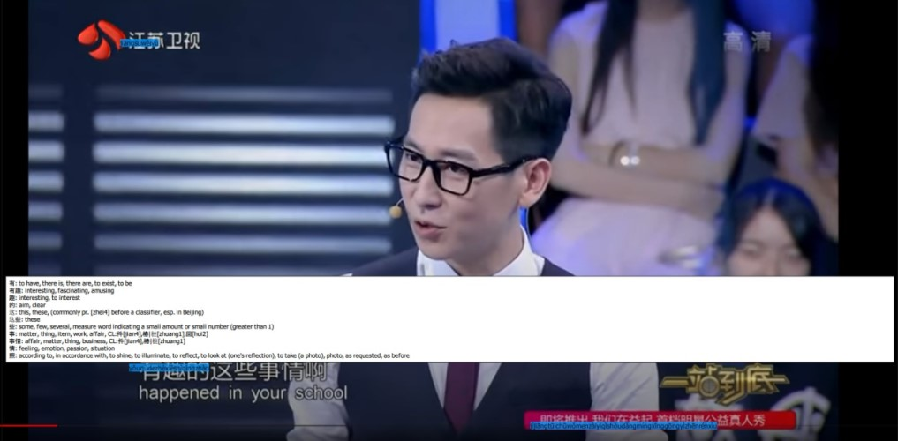

# Chinese Overlay
Detects Chinese text and displays an overlay with the corresponding pinyin, phrase translations and optionally a Google translation. Works on videos and anything else that can be visually captured from the screen.

## Usage
Prebuilt packages are made available for Windows that can be downloaded from the [Releases](https://github.com/RobinKa/Chinese-Overlay/releases) page.
Download, extract and run one of the following scripts:

|File|Description|Requirements
|--|--|--|
|overlay-pinyin|Displays a pinyin overlay (uses GPU)|Windows 1903 & DX12 GPU|
|overlay-google-trans|Displays a google-translated overlay (uses GPU)|Windows 1903 & DX12 GPU|
|overlay-pinyin-cpu|Displays a pinyin overlay (uses CPU, slower)|None|
|overlay-google-trans-cpu|Displays a google-translated overlay (uses CPU, slower)|None|

The gpu versions make use of your GPU using [DirectML](https://docs.microsoft.com/en-us/windows/win32/direct3d12/dml-intro) which speeds up the detection significantly.

After launching a window will appear. Resize this window to contain the area that you want to translate. Press F8 to toggle the overlay. The first press will initiate the detection, translation and show the overlay. The second press will make the overlay disappear.

## Advanced usage
The overlay can also be started by executing the program from the command line with the `ui` subcommand ´(`cli.exe ui`) which opens up more options that can be found by typing `cli.exe --help` and `cli.exe ui --help`.
Instead of using the prepackaged binaries we can also run the python program directly. The [requirements file](/requirements.txt) contains all the necessary requirements and some optional ones. However to use the DirectML interface a modified version is required with [this](https://github.com/microsoft/onnxruntime/pull/3359) PR and [this](https://github.com/microsoft/onnxruntime/issues/3360) fix to make it work with the default Windows DirectML library). Alternative execution providers such as CUDA can also be used and a list of them is available [here](https://github.com/microsoft/onnxruntime#supported-accelerators). The program should also work on non-Windows systems has not been tested much there.

## Running a translation server
The project also contains an http server that can run OCR on received images and return the results. It can be started by specifying the `server` argument. This makes it possible to easily make frontends in other languages
or to use the OCR for any other purpose.

## Acknowledgements
- [Courao (唐董琦)'s ocr.pytorch](https://github.com/courao/ocr.pytorch) used for OCR
- [ONNX Runtime](https://github.com/microsoft/onnxruntime) for an easy to use neural network runtime that supports a lot of different systems